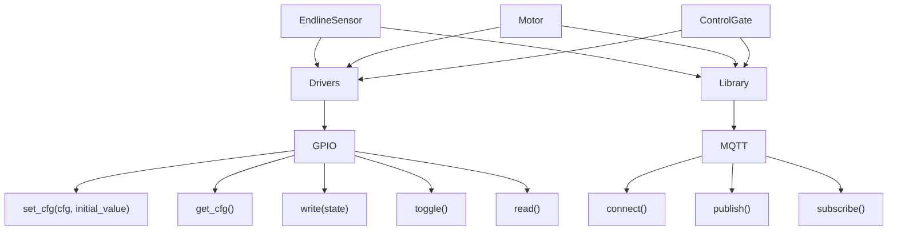

# Automatic Gateway

## Architecture


## External Interruptions
The GPIO6, GPIO7, GPIO8, GPIO9, GPIO10, and GPIO11 can not recommended to use as interrupts because they are used by the SPI Flash communication.

## Code Quality
The project uses `clang-format` to enforce code style, to format the code run:
```bash
clang-format -i *.cpp *.h
```

### Download Clang-Format
- Linux:
    ```bash
    sudo apt-get install clang-format
    ```
- Windows:
  - Go to [LLVM GitHub](https://github.com/llvm/llvm-project/releases) releases page.
  - Download the `LLVM-19.1.0-win64.exe` file.
  - Run the installer and make sure to add LLVM to the system PATH.
**Note**: The `19.1.3` not works in my machine.

## Workflow
Own workflow is in `docs/development/workflow.md`.

## References
- [Clang-Format Download](https://medium.com/@swargarajd/installing-clang-formatter-in-visual-studio-code-for-windows-9a4fc882785c)