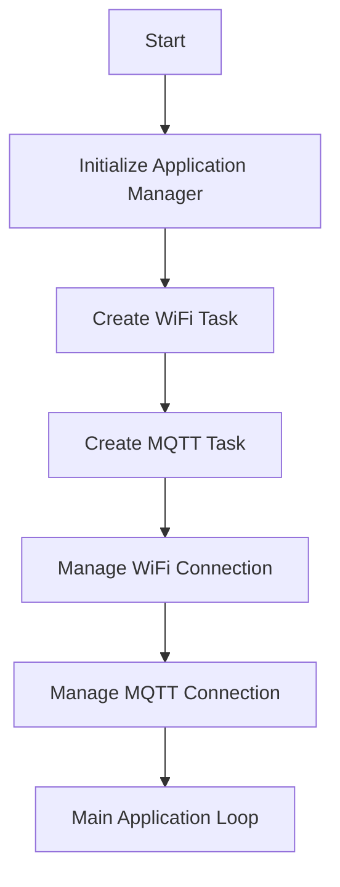

# Application Manager

## Overview
The Application Manager module manages the overall application, including WiFi and MQTT connections. It creates tasks for managing these connections and handles the main application logic.

## How It Works


## External Dependencies
- **ESP-IDF**: Provides the necessary libraries and tools for ESP32 development.
- **FreeRTOS**: Used for task management and synchronization.
- **WiFi API**: Provides WiFi functionalities.
- **MQTT 5 API**: Provides MQTT functionalities.

## Configuration Details
1. Include the Application Manager module in your project by adding it to your CMakeLists.txt:
  ```cmake
  idf_component_register(SRCS "app_manager.c"
                      INCLUDE_DIRS "include" "../../secrets"
                      PRIV_REQUIRES wifi_api mqtt5_api)
  ```
2. `secrets` folder: To configure the WiFi and MQTT credentials, create a folder named `secrets` in the root of the application and create a file named `wifi_secrets.h` and `mqtt_secrets.h` with the following content:
  ```c
  #ifndef WIFI_SECRETS_H
  #define WIFI_SECRETS_H

  #define WIFI_SSID "your wifi ssid"
  #define WIFI_PASSWORD "your wifi password"

  #endif // WIFI_SECRETS_H
  ```
  ```c
  #ifndef MQTT_SECRETS_H
  #define MQTT_SECRETS_H

  #define MQTT_BROKER_URL "mqtt://your.broker.url"
  #define MQTT_USERNAME "your mqtt username"
  #define MQTT_PASSWORD "your mqtt password"
  #define MQTT_PORT 1883

  #endif // MQTT_SECRETS_H
  ```

## CMake Options
- `PRIV_REQUIRES`: It's meant to be internal to the component., i.e., can't be used in header files.
