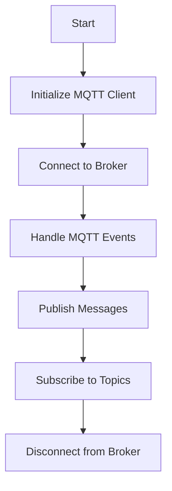

# MQTT 5 API

## Overview
The MQTT 5 API module provides functionalities to connect, publish, and subscribe to MQTT topics using the MQTT 5 protocol. It handles various MQTT events and supports advanced features like user properties and subscription options.

## How It Works

## External Dependencies
- **ESP-IDF**: Provides the necessary libraries and tools for ESP32 development.
- **FreeRTOS**: Used for task management and synchronization.
- **MQTT Client**: Provides the MQTT client functionalities.

## Installation
- Include the MQTT 5 API module in your project by adding it to your CMakeLists.txt:
idf_component_register(SRCS "mqtt5_api.c"
                    INCLUDE_DIRS "include"
                    REQUIRES mqtt5_api)

## Configuration Details
- **Broker URL**: The URL of the MQTT broker.
- **Username**: The username for MQTT authentication.
- **Password**: The password for MQTT authentication.
- **Port**: The port for MQTT connection (1883 for MQTT, 8883 for MQTT over SSL).

## References
- [ESP-IDF MQTT API](https://docs.espressif.com/projects/esp-idf/en/v5.3.1/esp32/api-reference/protocols/mqtt.html)
- [MQTT 5.0 Example](https://github.com/espressif/esp-idf/tree/master/examples/protocols/mqtt5)
