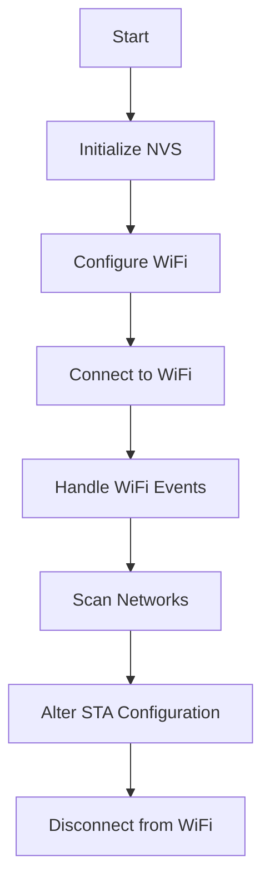

# WiFi API

## Overview
The WiFi API module provides functionalities to configure, connect, and manage WiFi connections on the ESP32. It includes functions for scanning available networks, altering station configurations, and handling WiFi events.

## How It Works


## External Dependencies
- **ESP-IDF**: Provides the necessary libraries and tools for ESP32 development.
- **FreeRTOS**: Used for task management and synchronization.
- **NVS Flash**: Used for storing WiFi credentials.

## Requirements
The target network must be a router and configured to use `WIFI_AUTH_WPA_WPA2_PSK` security and 2.4GHz frequency band.

## How to Use
1. Ensure you have the ESP-IDF installed and set up.
2. Include the WiFi API module in your project by adding it to your `CMakeLists.txt`:
```cmake
idf_component_register(SRCS "wifi_api.c"
                    INCLUDE_DIRS "include"
                    REQUIRES wifi_api)
```

## CMake Options
- `REQUIRES`: Other components depending on your component will also inherit these dependencies, i.e., can be used in header files.

## WiFi Setup
To configure the WiFi credentials create a folder named `secrets` in the root of the application and create a file named `wifi_secrets.h` with the following content:
```c
#ifndef WIFI_SECRETS_H
#define WIFI_SECRETS_H

#define WIFI_SSID "your wifi ssid"
#define WIFI_PASSWORD "your wifi password"

#endif // WIFI_SECRETS_H
```
**NOTE**: The `secrets` folder is added to the `.gitignore` file so that it is not committed to the repository.


## References
- [WiFi API](https://docs.espressif.com/projects/esp-idf/en/v5.3.1/esp32/api-guides/wifi.html)
- [WiFi Example](https://github.com/espressif/esp-idf/tree/master/examples/wifi/getting_started/station)
